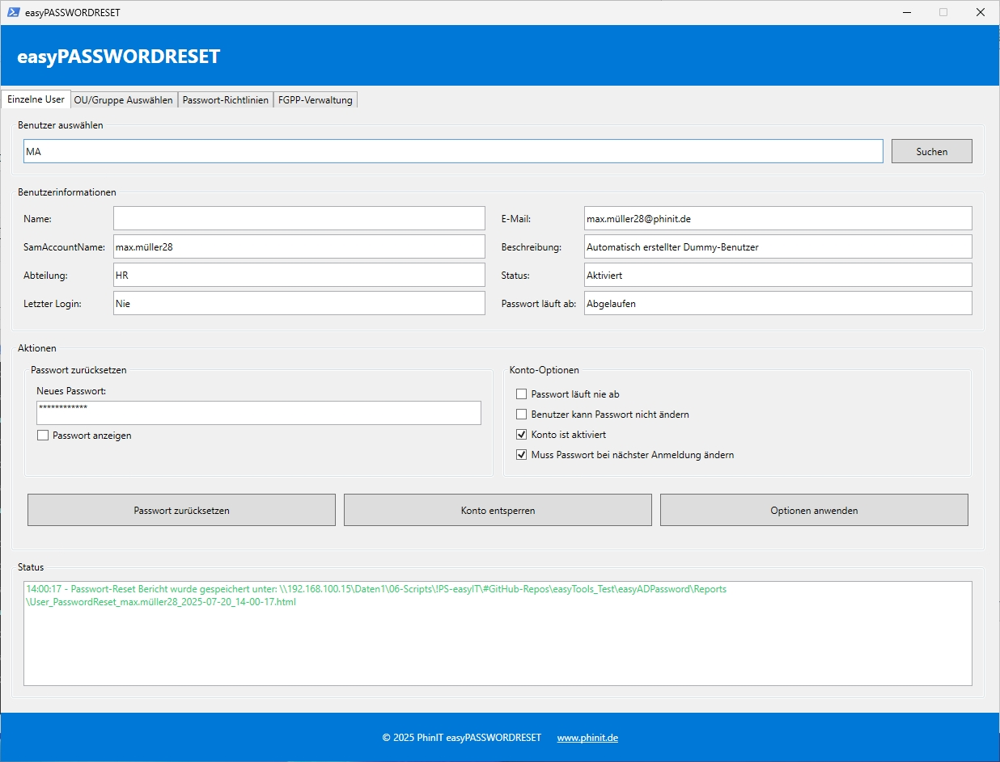

# easyADPassword - Active Directory Password Management Tool



## Short Description
A comprehensive PowerShell GUI tool for secure Active Directory password management, including password reset, account unlock, and Fine-Grained Password Policy (FGPP) administration with HTML/TXT reporting capabilities.

## Description
easyADPassword is a powerful Windows PowerShell application with a modern WPF interface designed for IT administrators to efficiently manage Active Directory user passwords and account security. The tool provides secure password reset functionality, account unlock capabilities, bulk operations for OUs and groups, and comprehensive Fine-Grained Password Policy management. All operations are logged and can generate detailed HTML and TXT reports for documentation and compliance purposes.

## Tags
`powershell` `active-directory` `password-management` `wpf-gui` `it-administration` `fgpp` `password-reset` `account-unlock` `windows` `sysadmin` `enterprise` `security` `reporting` `bulk-operations`

---

## 🔧 Features / Funktionen

### English
- **Secure Password Reset**: Reset passwords for individual users or bulk operations
- **Account Unlock**: Unlock locked Active Directory accounts
- **Fine-Grained Password Policies (FGPP)**: Create, edit, and manage password policies
- **Bulk Operations**: Reset passwords or unlock accounts for entire OUs or groups
- **Modern WPF Interface**: User-friendly graphical interface with tabbed navigation
- **Comprehensive Reporting**: Generate HTML and TXT reports for all operations
- **Multi-language Support**: German and English interface support
- **Secure Password Generation**: Generate complex passwords meeting policy requirements
- **AD Connection Status**: Real-time Active Directory connection monitoring
- **Detailed Logging**: Comprehensive logging for audit trails and troubleshooting

### Deutsch
- **Sichere Passwort-Zurücksetzung**: Zurücksetzen von Passwörtern für einzelne Benutzer oder Massenoperationen
- **Konto-Entsperrung**: Entsperren gesperrter Active Directory-Konten
- **Feingliedrige Passwort-Richtlinien (FGPP)**: Erstellen, Bearbeiten und Verwalten von Passwort-Richtlinien
- **Massenoperationen**: Passwörter zurücksetzen oder Konten für ganze OUs oder Gruppen entsperren
- **Moderne WPF-Oberfläche**: Benutzerfreundliche grafische Oberfläche mit Register-Navigation
- **Umfassende Berichterstattung**: Generierung von HTML- und TXT-Berichten für alle Operationen
- **Mehrsprachiger Support**: Deutsche und englische Benutzeroberfläche
- **Sichere Passwort-Generierung**: Erstellung komplexer Passwörter entsprechend Richtlinien-Anforderungen
- **AD-Verbindungsstatus**: Echtzeitüberwachung der Active Directory-Verbindung
- **Detaillierte Protokollierung**: Umfassende Protokollierung für Audit-Trails und Fehlerbehebung

---

## 📋 Requirements / Voraussetzungen

### English
- Windows PowerShell 5.1 or PowerShell 7.x
- Windows operating system with .NET Framework 4.7.2 or higher
- Active Directory PowerShell module (RSAT-AD-PowerShell)
- Domain administrator or appropriate AD permissions
- Network connectivity to Active Directory domain controllers

### Deutsch
- Windows PowerShell 5.1 oder PowerShell 7.x
- Windows-Betriebssystem mit .NET Framework 4.7.2 oder höher
- Active Directory PowerShell-Modul (RSAT-AD-PowerShell)
- Domänen-Administrator oder entsprechende AD-Berechtigungen
- Netzwerkverbindung zu Active Directory-Domänencontrollern

---

## 🚀 Installation

### English
1. Download the latest release from the [Releases](../../releases) page
2. Extract the files to your desired directory
3. Ensure you have the required PowerShell modules installed:
   ```powershell
   Install-WindowsFeature -Name RSAT-AD-PowerShell
   ```
4. Right-click on `easyADPW_V0.0.1.ps1` and select "Run with PowerShell" or execute in PowerShell ISE/VS Code

### Deutsch
1. Laden Sie die neueste Version von der [Releases](../../releases)-Seite herunter
2. Extrahieren Sie die Dateien in Ihr gewünschtes Verzeichnis
3. Stellen Sie sicher, dass Sie die erforderlichen PowerShell-Module installiert haben:
   ```powershell
   Install-WindowsFeature -Name RSAT-AD-PowerShell
   ```
4. Klicken Sie mit der rechten Maustaste auf `easyADPW_V0.0.1.ps1` und wählen Sie "Mit PowerShell ausführen" oder führen Sie es in PowerShell ISE/VS Code aus

---

## 🔐 Digital Signature / Digitale Signatur

### English
This script is digitally signed for security and authenticity. The public certificate used for signing is available in our certificate repository:

**Certificate Repository**: [PowerShell_Certificate](https://github.com/PS-easyIT/PowerShell_Certificate)

The digital signature ensures:
- Script integrity and authenticity
- Protection against unauthorized modifications
- Compliance with enterprise security policies

### Deutsch
Dieses Skript ist digital signiert für Sicherheit und Authentizität. Das für die Signierung verwendete öffentliche Zertifikat ist in unserem Zertifikat-Repository verfügbar:

**Zertifikat-Repository**: [PowerShell_Certificate](https://github.com/PS-easyIT/PowerShell_Certificate)

Die digitale Signatur gewährleistet:
- Skript-Integrität und Authentizität
- Schutz vor unbefugten Änderungen
- Einhaltung von Unternehmenssicherheitsrichtlinien

---

## 📖 Usage / Verwendung

### English

#### Basic Password Reset
1. Launch the application with administrator privileges
2. Navigate to the "Single User" tab
3. Enter the username in the search field
4. Click "Search User" to locate the account
5. Click "Reset Password" to generate a new secure password
6. The new password will be displayed and can be exported to a report

#### Bulk Operations
1. Navigate to the "OU Operations" or "Group Operations" tab
2. Select the target Organizational Unit or Group
3. Choose the desired operation (Reset Passwords or Unlock Accounts)
4. Review the list of affected users
5. Execute the operation and generate reports

#### FGPP Management
1. Navigate to the "FGPP Management" tab
2. View existing Fine-Grained Password Policies
3. Create new policies or edit existing ones
4. Assign policies to groups or users
5. Monitor policy compliance

### Deutsch

#### Grundlegende Passwort-Zurücksetzung
1. Starten Sie die Anwendung mit Administratorrechten
2. Navigieren Sie zum "Einzelbenutzer"-Tab
3. Geben Sie den Benutzernamen in das Suchfeld ein
4. Klicken Sie auf "Benutzer suchen", um das Konto zu finden
5. Klicken Sie auf "Passwort zurücksetzen", um ein neues sicheres Passwort zu generieren
6. Das neue Passwort wird angezeigt und kann in einen Bericht exportiert werden

#### Massenoperationen
1. Navigieren Sie zum "OU-Operationen"- oder "Gruppen-Operationen"-Tab
2. Wählen Sie die Ziel-Organisationseinheit oder -Gruppe aus
3. Wählen Sie die gewünschte Operation (Passwörter zurücksetzen oder Konten entsperren)
4. Überprüfen Sie die Liste der betroffenen Benutzer
5. Führen Sie die Operation aus und generieren Sie Berichte

#### FGPP-Verwaltung
1. Navigieren Sie zum "FGPP-Verwaltung"-Tab
2. Zeigen Sie bestehende Feingliedrige Passwort-Richtlinien an
3. Erstellen Sie neue Richtlinien oder bearbeiten Sie bestehende
4. Weisen Sie Richtlinien Gruppen oder Benutzern zu
5. Überwachen Sie die Richtlinien-Compliance

---

## 📊 Reports / Berichte

### English
The application generates detailed reports in two formats:

#### HTML Reports
- Professional formatting with company branding
- Detailed user information and operation results
- Timestamp and administrator information
- Suitable for management reporting and compliance documentation

#### TXT Reports
- Plain text format for simple viewing and printing
- Contains all essential information
- Suitable for quick reference and basic documentation

Reports are automatically saved in the `Reports` folder within the application directory.

### Deutsch
Die Anwendung generiert detaillierte Berichte in zwei Formaten:

#### HTML-Berichte
- Professionelle Formatierung mit Firmen-Branding
- Detaillierte Benutzerinformationen und Operationsergebnisse
- Zeitstempel und Administrator-Informationen
- Geeignet für Management-Berichterstattung und Compliance-Dokumentation

#### TXT-Berichte
- Einfaches Textformat für einfache Anzeige und Druck
- Enthält alle wesentlichen Informationen
- Geeignet für schnelle Referenz und Basis-Dokumentation

Berichte werden automatisch im `Reports`-Ordner im Anwendungsverzeichnis gespeichert.

---

## 🔧 Configuration / Konfiguration

### English
The script includes a comprehensive configuration section that can be customized:

```powershell
$script:Config = @{
    AppName = "easyPASSWORDRESET"
    ThemeColor = "#2E86AB"
    Debug = $true
    HeaderLogoURL = "https://example.com/logo.png"
    FooterWebseite = "https://www.example.com"
    # Additional configuration options...
}
```

### Deutsch
Das Skript enthält einen umfassenden Konfigurationsbereich, der angepasst werden kann:

```powershell
$script:Config = @{
    AppName = "easyPASSWORDRESET"
    ThemeColor = "#2E86AB"
    Debug = $true
    HeaderLogoURL = "https://example.com/logo.png"
    FooterWebseite = "https://www.example.com"
    # Weitere Konfigurationsoptionen...
}
```

---

## 🐛 Troubleshooting / Fehlerbehebung

### English

#### Common Issues
1. **"Cannot load Active Directory module"**
   - Install RSAT-AD-PowerShell feature
   - Run as administrator

2. **"Access Denied" errors**
   - Ensure you have appropriate AD permissions
   - Run PowerShell as administrator

3. **GUI not displaying correctly**
   - Check .NET Framework version (4.7.2+ required)
   - Verify WPF assemblies are available

#### Logging
Detailed logs are written to `easyPASSWORDRESET.log` in the application directory. Enable debug mode in the configuration for verbose logging.

### Deutsch

#### Häufige Probleme
1. **"Active Directory-Modul kann nicht geladen werden"**
   - Installieren Sie das RSAT-AD-PowerShell-Feature
   - Als Administrator ausführen

2. **"Zugriff verweigert"-Fehler**
   - Stellen Sie sicher, dass Sie entsprechende AD-Berechtigungen haben
   - PowerShell als Administrator ausführen

3. **GUI wird nicht korrekt angezeigt**
   - .NET Framework-Version prüfen (4.7.2+ erforderlich)
   - WPF-Assemblies-Verfügbarkeit überprüfen

#### Protokollierung
Detaillierte Protokolle werden in `easyPASSWORDRESET.log` im Anwendungsverzeichnis geschrieben. Aktivieren Sie den Debug-Modus in der Konfiguration für ausführliche Protokollierung.

---

## 🤝 Contributing / Mitwirken

### English
We welcome contributions to improve easyADPassword! Please feel free to:
- Report bugs and issues
- Suggest new features
- Submit pull requests
- Improve documentation

### Deutsch
Wir begrüßen Beiträge zur Verbesserung von easyADPassword! Bitte zögern Sie nicht:
- Fehler und Probleme zu melden
- Neue Funktionen vorzuschlagen
- Pull-Requests einzureichen
- Dokumentation zu verbessern

---

## ⚠️ Disclaimer / Haftungsausschluss

### English
This tool is provided "as is" without warranty of any kind. Always test in a development environment before using in production. The authors are not responsible for any damage or data loss that may occur from using this software.

### Deutsch
Dieses Tool wird "wie besehen" ohne jegliche Garantie bereitgestellt. Testen Sie immer in einer Entwicklungsumgebung, bevor Sie es in der Produktion verwenden. Die Autoren sind nicht verantwortlich für Schäden oder Datenverluste, die durch die Verwendung dieser Software entstehen können.